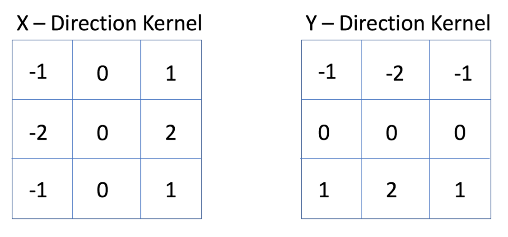

## Visualize filters and feature maps of convolution layers

Before deep learning methods conquer the machine vision world, machine learning algorithm was so popular. They used mathematic equation to extract patterns from images. By advance of deep learning networks, machine learning methods gradually got away from this field. 
Deep learning methods are so great, but they've got a big problem. The problem is that It's so hard to know what's going on in them.
In this project, we are going to work with convolutional neural networks, and we'll try to visualize filters and their feature maps. But before that we are going to look talk about machine learning method a little bit.

As we said, machine learning methods are using mathematical equation to extract patterns from images. We call these methods "feature extractor". To name a few, erosion and dilation, LBP, Sober filter and many more. These methods are used to extract edges and lines in the image. For example, The sober filter which used as an edge detector, and you can see it in following image roll over image like convolutional network and extract edges in the image.

As we will see later, the kernels of learned convolutional neural networks behave like sober filter and the other feature extractors. 
In this repo we used a trained ResNet model with 50 convolutional layers, we're going to visualize some filters and feature maps of this network.

For more information, check [this tutorial](https://machinelearningmastery.com/how-to-visualize-filters-and-feature-maps-in-convolutional-neural-networks/)

### Filters

these are some filters from the first layer of the network. The network has 7*7 kernel in the first layer.

In previous image, we visualize 6 filters, also we got 3 filters for different input channel (RGB). Some of them are the same across input channels (first raw) and some of them are different (second raw). In the first raw, seems like the kernel is used to extract diagonal edges of the image. Later we will see filters and their corresponding output for better comprehension.

### Feature maps (FM)

the output folder contains feature map from different layers.
The following image has 64 feature maps from the first layer. As we can see, in some of them different edges got detected like the FM in the first raw and column or the FM in the first raw and fifth column which seems that the horizontal edges got detected. Some of them separate the object from the background like the FM in forth raw and third, sixth column.

In the next layers, the extracted feature will be combined to detect more complex shape like in this photo could be head or legs etc.

And in the last layer is so hard to even know what this feature maps represent, and it's more like filters of the network. The following image is the FM from the last layer of the network. Each feature could have meaning to network, like this is a car or this is a horse, but for us is just a some light and black dots.

### Filters and their correspond FM

In the following image, we can see filters and their corresponding FM.

